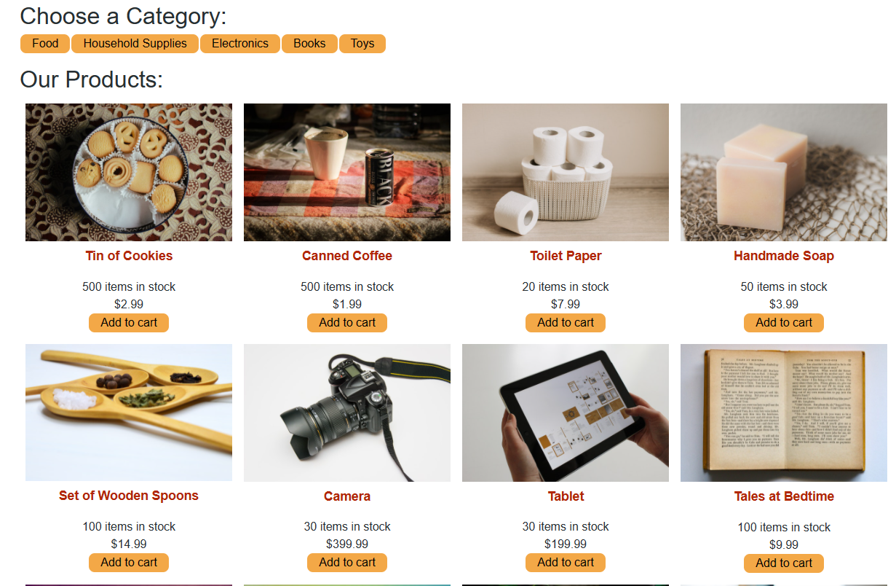

#E-Commerece using Redux

### Description

This shop application has been converted to using redux to manage global state.

### Table of Contents

- [Usage Guide](#Usage-Guide)
- [Install Instructions](#Installation)
- [Technologies Used](#Technologies-Used)
- [Contributions](#Contributions)
- [Tests](#Tests)
- [Questions](#Questions)

## Usage Guide

This application is deployed live.

Visit [E-Commerce Redux](https://salty-atoll-67944.herokuapp.com/) on Heroku.

## Installation

If you would like to install the application on your local machine..

Download the package to your local machine

Install required packages

`NPM install`

Run the application

`NPM Start`

Add data to database

`NPM Run Seed`

## Technologies Used

React, Redux, Node

## Contributions

This site is designed by Coding Bootcamp team, has beeen modified to use redux store from context.

## Tests

Future testing planned using Jest testing framework

## Questions

If you have any questions or want to keep up with my latest projects, please follow me on [Github](http://www.github.com/operationBrass) or contact me via [Email](mr.brn.lewis@outlook.com).
